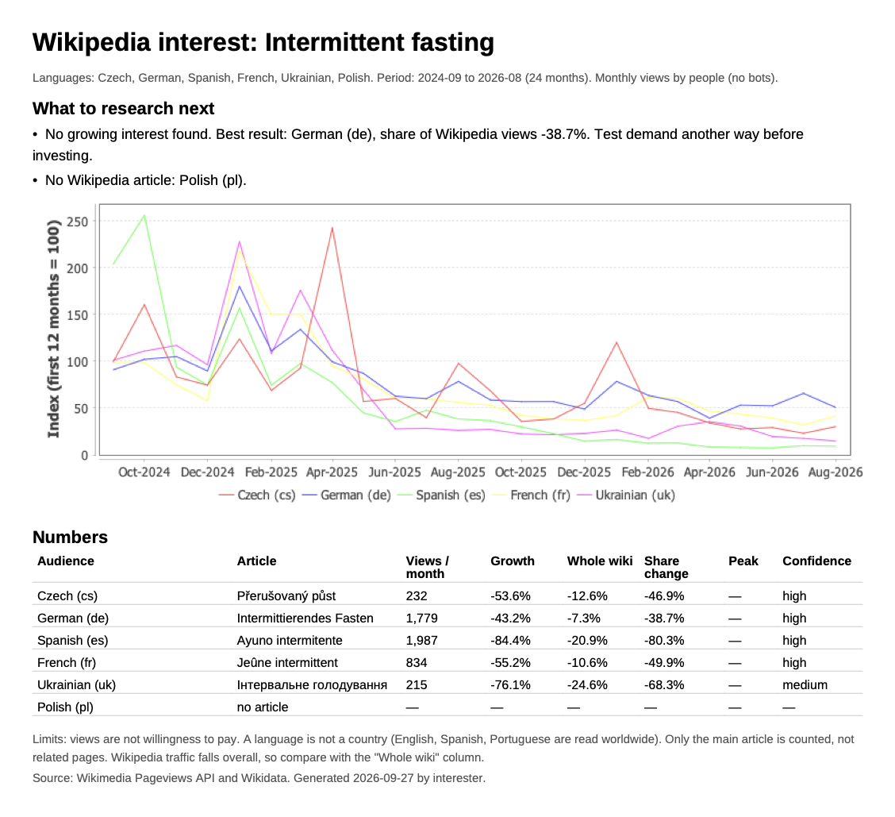
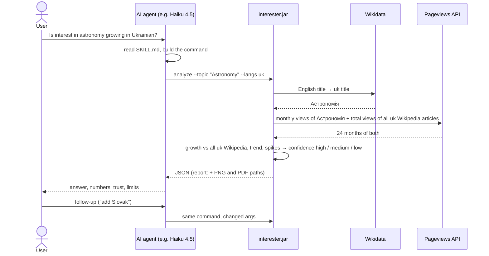

# Interester

An [Agent Skill](https://agentskills.io/specification) that helps B2C teams choose what to research next
(a course, a topic or a language audience) from Wikipedia pageviews.
The AI agent asks, our Java tool does all data work and math, the agent explains the result.

## Example of the tool report: 



*`report --topic "Intermittent fasting" --langs cs,de,es,fr,uk,pl`, the PDF shown as an image.*

## Tech stack
| What        | Used                                                                                        |
|-------------|---------------------------------------------------------------------------------------------|
| Language    | Java 25                                                                                     |
| Build       | Maven 3.9 via wrapper `mvnw`                                                                |
| Libraries   | Lombok, Jackson, Apache Commons Math (linear regression), JFreeChart (chart gen), OpenPDF (PDF gen) |                                                                                                                                         |

## Architecture
```
SKILL.md            instructions for the AI: which command to run, how to read the JSON, how to answer
src/main/java/org/interester/
  Main, JsonOutput  entry point; prints one JSON object to stdout
  cli/              parse and check args (error JSON with a hint for the AI)
  data/             Wikidata + Pageviews clients, retry on 429/5xx, proxy, in-memory cache
  analyze/          statistics, confidence, ranking
  report/           chart (PNG) and one-page PDF
```

## Request flow


## From topic to numbers
1. **The AI translates the topic.** The user can write in any language and any words ("mindfull meditaton").
   The AI (following `SKILL.md`) picks the matching **English Wikipedia article title** ("Meditation") and passes it as `--topic`.
   If the AI uses a close article instead of the exact idea ("English language" for "learning English"), it tells the user.
2. **Wikidata API finds the article in each language.** One article exists in many languages under different titles.
   Wikidata stores these links for every article. We call
   `https://www.wikidata.org/w/api.php?action=wbgetentities&sites=enwiki&titles=Astronomy&props=sitelinks`
   and get `ukwiki: Астрономія`, `cswiki: Astronomie`, … No translation by us or the AI, the titles come from Wikipedia itself.
3. **Wikimedia Pageviews API gives the views.** For each title we get monthly views by people (no bots):
   `https://wikimedia.org/api/rest_v1/metrics/pageviews/per-article/uk.wikipedia/all-access/user/Астрономія/monthly/20240901/20260831`,
   plus all views of that language edition (`/aggregate/uk.wikipedia/...`) to compare with the whole Wikipedia.
 
## Statistics
Example: `analyze --topic "Astronomy" --langs uk`, Sep 2024 – Aug 2026, monthly views:
`4687, 1776, 1746, … 1642 (Sep 2025), … 322, 360`.

| Step | How | Example result |
|---|---|---|
| Clean data | Drop the current, not finished month. If a month is not published yet, move the whole period back. | 24 full months |
| Volume | Median of monthly views (not the mean, so one big month does not inflate it). | 611 views/month |
| Growth | Sum of last 12 months vs sum of the 12 before. | 6,708 vs 16,614 → **−59.6%** |
| Whole wiki | Same for all views of that language edition. | **−24.6%** (Wikipedia traffic falls overall) |
| **Share change** (main number) | `(100 + growth) / (100 + wiki growth) − 1`. Removes the general Wikipedia decline. ±10% = no signal. | 40.4 / 75.4 − 1 = **−46.4%** |
| Spikes | A month above 3× the median is a spike (news, school start). | Sep 2024: 4,687 > 3 × 611 |
| Spike check | Replace spike months with the median and compute growth again. If it changes sign or halves, growth is "spike-driven". | −46.5% (still falling) → not spike-driven |
| Trend | Linear regression (Commons Math `SimpleRegression`). Slope as % of the mean per month; R² = how well the line fits. | −9.6%/month, R² 0.48 |
| Seasonality | In each year, the top month, if ≥ 1.5× that year's median. Same month in most years → peak. | September (school year) |
| Confidence | Reasons that lower it: < 100 views/month (→ low), R² < 0.3, spike-driven, < 24 months, share within ±10%. Reasons that raise it: R² ≥ 0.6, share beyond ±10%. 2+ lowering → low; 1 lowering or none raising → medium; else high. | Share −46% raises, nothing lowers → **high** |
| Ranking | By share change; for periods under 24 months, by trend slope. | |
| Summary | Fixed rules turn the best usable result into a sentence (`summary` in JSON, top of the PDF): share ≥ +10% → "research first", ±10% → "keeps its share", below → "no growing interest". Low-confidence and missing results are listed. The AI repeats it, it does not write its own verdict. | "No growing interest found. Best result: Ukrainian (uk), share −46.4%." |

So the answer is: interest in astronomy falls faster than Ukrainian Wikipedia itself, and we can trust this.
All thresholds and reason codes: [doc/contract.md](doc/contract.md).

## Install and build
[SDKMAN](https://sdkman.io) installs Java and Maven (macOS, Linux, WSL):
```
curl -s "https://get.sdkman.io" | bash
sdk install java 25.0.4-amzn     # any Java 25+ works, see `sdk list java`
sdk install maven                # optional: ./mvnw (Windows mvnw.cmd) downloads Maven by itself

mvn -q package -DskipTests       # → target/interester.jar   (mvn package = same + 31 unit tests)
```
To use it as a skill, copy this folder to the agent's skills folder (e.g. `~/.claude/skills/interester`).
Optional env vars: `INTERESTER_CONTACT` (email/URL for the User-Agent, Wikimedia asks for it), `HTTPS_PROXY`.

## How to use
Normally the AI runs these commands. You can run them yourself too, each prints one JSON object.

| Command | What it does |
|---|---|
| `analyze` | Fetches the views, computes the statistics, prints JSON (summary, results, ranking). The AI answers in chat. |
| `report` | Same as `analyze` + a PNG chart and a one-page PDF in `./out`, paths in `files`. |

Results for Sep 2024 – Aug 2026 (checked 2026-09-27):

| Use case | Command | Result |
|---|---|---|
| Is interest growing in one language? | `java -jar target/interester.jar analyze --topic "Astronomy" --langs uk` | `Астрономія`: views −59.6%, whole wiki −24.6%, share −46.4%, 611 views/month, peak September, confidence high |
| Compare languages, longer period | `java -jar target/interester.jar analyze --topic "Intermittent fasting" --langs pl,cs --months 36` | pl: `found: false` (no Polish article). cs `Přerušovaný půst`: share −46.9%, 317 views/month, high |
| Short period (trend only) | `java -jar target/interester.jar analyze --topic "Chess" --langs uk,cs --months 12` | No growth vs last year (needs 24 months), ranked by trend: cs −2.3%/month, uk −6.1%/month, medium |
| Compare topics, get a PDF | `java -jar target/interester.jar report --topic "English language" --topic "Chess" --langs de,pl` | Same JSON + `files.pdf` and `files.chart` (absolute paths in `./out`), PDF like the image above |
| Local title missing in Wikidata | `java -jar target/interester.jar analyze --topic "Chess" --langs cs --article cs:Šachy` | Uses the given title for cs |
| Wrong args | `java -jar target/interester.jar analyze --topic "Chess"` | `"status": "error"`, `INVALID_ARGS`, "Missing --langs." + usage hint |

| Option | Meaning |
|---|---|
| `--topic "<English title>"` | English Wikipedia article. Repeat for more topics. |
| `--langs uk,cs` | Wikipedia language codes, max 10. |
| `--months N` | 12–120, default 24. |
| `--end YYYY-MM` | Last month. Default: last complete month. |
| `--article lang:Title` | Set the title in one language by hand. |
| `--out <dir>` | `report` only, default `./out`. Max 12 topic × language pairs. |


## Next steps
Ideas for better results and bigger research: [doc/improvements.md](doc/improvements.md).
